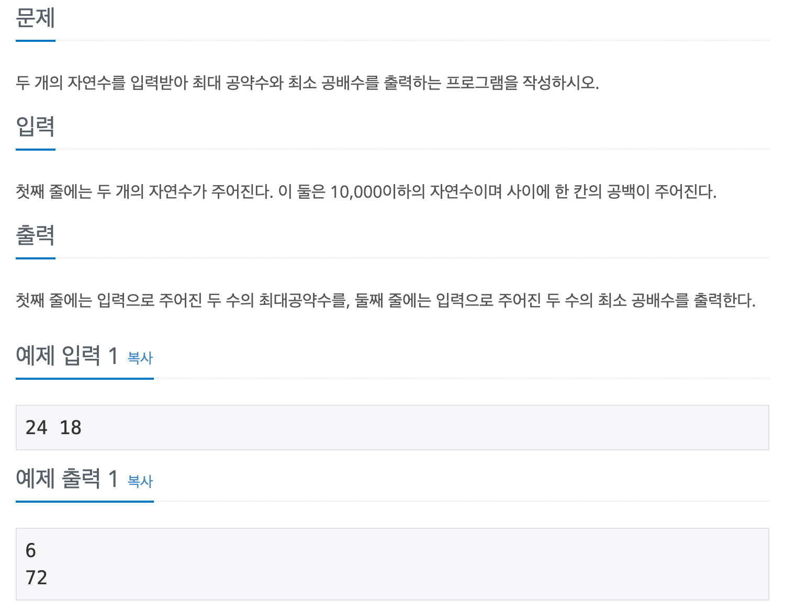

## 📖 [최대공약수와 최소공배수](https://www.acmicpc.net/problem/2609)

---
#### 📍 풀이
- 유클리드 호제법을 이용한 풀이
- 최대공약수를 유클리드 호제법을 구현한 재귀함수로 구한 후에, 최소공배수는 `두 수의 곱 / 최대공약수` 로 구한다.
---
#### 📍 느낀점
- 쉬운 난이도이지만 유클리드 호제법을 이제서야 알게되었다. 잊어버리지 말아야겠다.