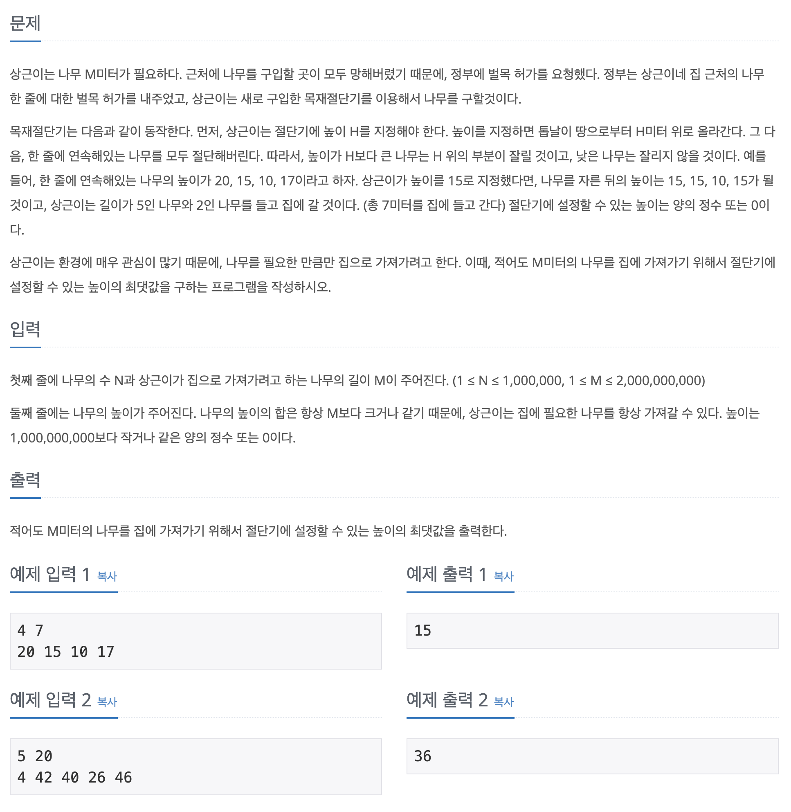

## 📖 [나무 자르기](https://www.acmicpc.net/problem/2805)

---
#### 📍 풀이
- 이분탐색을 이용한 풀이
  - 0부터 주어진 나무 중 가장 높은 나무의 높이까지 이분 탐색을 통해 자를 높이를 정한다.
  - 해당 높이로 잘랐을 때 가져갈 수 있는 나무의 길이 sum을 구한다.
  - 잘라야 하는 길이 M보다 sum이 작을 경우에는 더 작은 집단에서, 그렇지 않을 경우에는 answer에 자른 높이를 저장한 후에 더 높은 집단에서 이분탐색을 실행한다. 
---
#### 📍 느낀점
- 문제를 읽고 바로 이분탐색이 떠오르지 않았다. M의 범위 때문에 그리디 방법으로만 생각하다가 풀리지 않아서 다른 풀이를 참고했다. 비슷한 유형을 많이 풀어서 익숙해져야겠다.