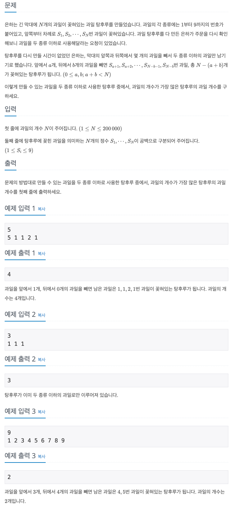

## 📖 [과일 탕후루](https://www.acmicpc.net/problem/30804)

---
#### 📍 풀이
- 투 포인터를 이용한 풀이
- 오른쪽 포인터를 처음부터 끝까지 한칸씩 이동하며 과일의 종류가 2 이하일 경우에 최댓값을 갱신시켰다.
- 과일 종류가 2를 초과하면 왼쪽 포인터를 과일 종류가 2 이하가 될 때까지 이동시켰다.
---
#### 📍 느낀점
- 포인터를 양 끝에서 시작하면 결국 모든 경우의 수를 다 고려해야 하기 때문에 시간초과가 된다. 