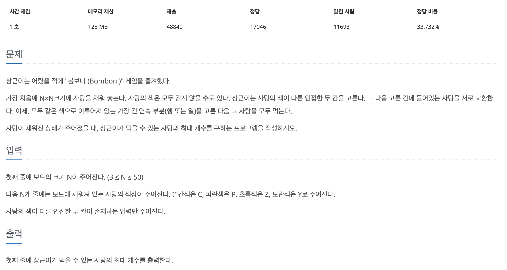

## 📖 [사탕게임](https://www.acmicpc.net/problem/3085)
#### 📍 문제

---
#### 📍 풀이
- 사탕의 위치를 바꾸는 것은 배열을 완전 탐색하며 해당 인덱스의 사탕 색을 아래, 오른쪽과 비교하여 일치하지 않으면 바꾸도록 했다.
- 위치를 바꿀 때 마다 얻을 수 있는 최대의 사탕 개수를 찾아 max 변수와 비교해 저장했다.
---
#### 📍 느낀점
- 사탕 개수를 비교할 때 열 방향과 행 뱡향으로 각각 나누어 반복문을 통해 구현했는데, 이 부분에서 더욱 최적의 방법이 있을지 다시 생각해봐야겠다. 