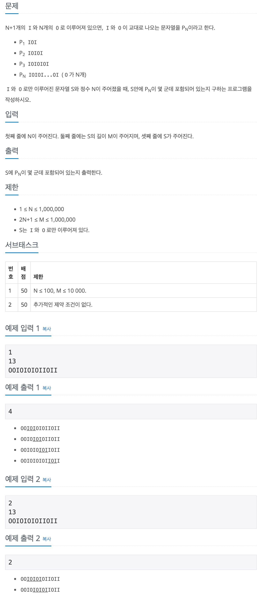

## 📖 [IOIOI](https://www.acmicpc.net/problem/5525)


---
#### 📍 풀이
- ❗️오답 풀이
  ```
  while (index != -1) {
			index = S.indexOf(P, index);

			if (index != -1) {
				ans++;
				index += 2;
			}
		}
    ```
  - String의 `indexOf()` method를 활용한 풀이
  - 패턴 `P`를 찾으면 해당 인덱스를 반환하고, 정답의 개수를 1 증가한다. 
  - `index + 2`부터 다시 해당 과정을 반복한다.
  - 시간초과 이유 : 문자열 `S`의 길이가 m이고, `P`의 길이가 `n`일 때, `S.indexOf(P)`의 시간복잡도는 최대 `O(m * n)`이다.

- 정답 풀이
  - 반복문을 통해 연속된 "IOI" 패턴의 개수를 찾는다.
  - 패턴이 연속하여 N번 반복되는 순간 정답의 개수를 1 증가하고, 연속된 패턴의 개수는 1 감소한다.
  - "IOI" 패턴이 아닐 경우에는 연속된 패턴의 개수를 저장하는 변수 `patternNum`을 초기화하고 다음 인덱스부터 다시 탐색한다.
---
#### 📍 느낀점
- 문제만 봤을 때는 String의 method로 쉽게 풀 수 있을 줄 알았는데, 오히려 시간복잡도가 증가했다.
- 단순하게 접근하면 쉬운 문제였지만, 방법을 찾지 못해 결국 다른 풀이를 참고했다.
- String에서 패턴 검색과 관련된 다양한 방법 및 알고리즘이 존재하는데 비슷한 유형의 다른 접근 방식을 많이 풀어봐야겠다.