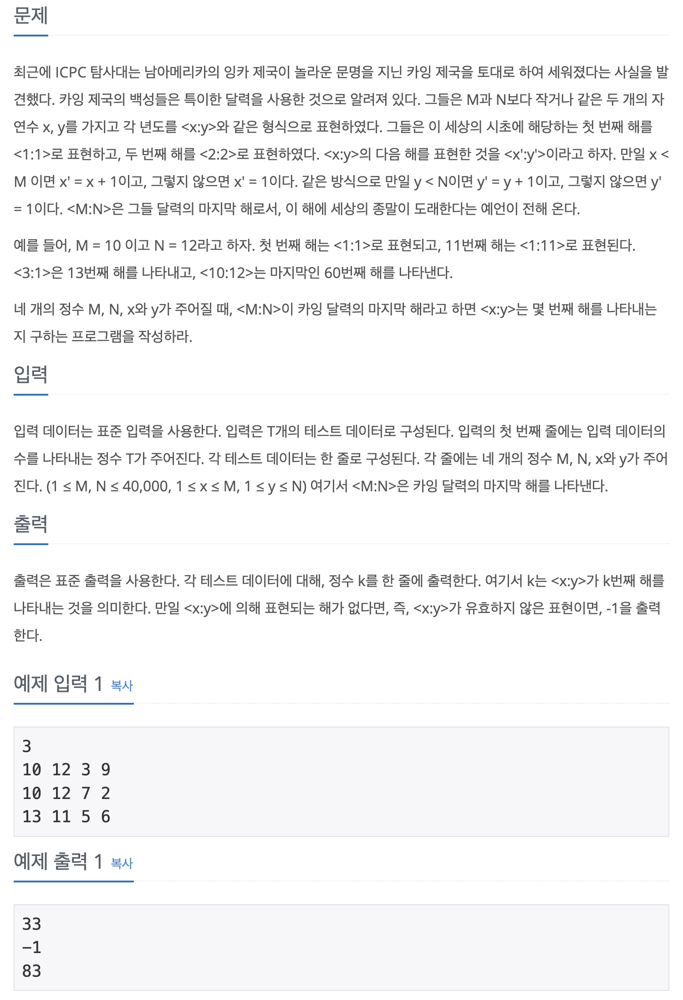

## 📖 [카잉 달력](https://www.acmicpc.net/problem/6064)

---
#### 📍 풀이
- 수식을 구현한 풀이
- 마지막 해는 M과 N의 최소공배수번째를 나타낸다. 편의상 `M * N`이라고 두고 연산을 수행하도록 했다.
- x일 때 가능한 해의 경우는 `M * a(임의의 정수) + x`번째 일 때이다. 마찬가지로 y일 때 가능한 해의 경우는 `N * b(임의의 정수) + y`번째 일 때이다. 따라서 두 경우가 같을 때 `<x:y>`로 표현되는 해가 존재한다.
- `num1 = M * a(임의의 정수) + x` , `num2 = N * b(임의의 정수) + y`로 놓고 두 가지를 비교했다. `num1 = num2`일 때 해당 경우가 정답이고, num1이 더 클 경우에는 b에 1을 더하고 다시 비교한다. 반대로 num2가 더 클 경우에는 a에 1을 더하고 다시 비교한다.
- num1과 num2가 모두 `M * N`보다 작을 동안 연산을 반복해서 `num1 = num2`인 경우가 존재하지 않는다면, 답이 존재하지 않는다.
---
#### 📍 느낀점
- 최소공배수 구현 방법을 몰라서 `M * N`으로 두었는데, 최소공배수를 구한 후에 반복문을 수행하면 실행 시간은 크게 차이가 나지 않을 것 같다. 그래도 이 기회로 최대공약수와 최소공배수를 구하는 알고리즘을 공부하게 되었다. ([최대공약수와 최소공배수](https://github.com/sehaim/algorithm/tree/master/BOJ_Solution/src/boj_2609_최대공약수와최소공배수) 참고)