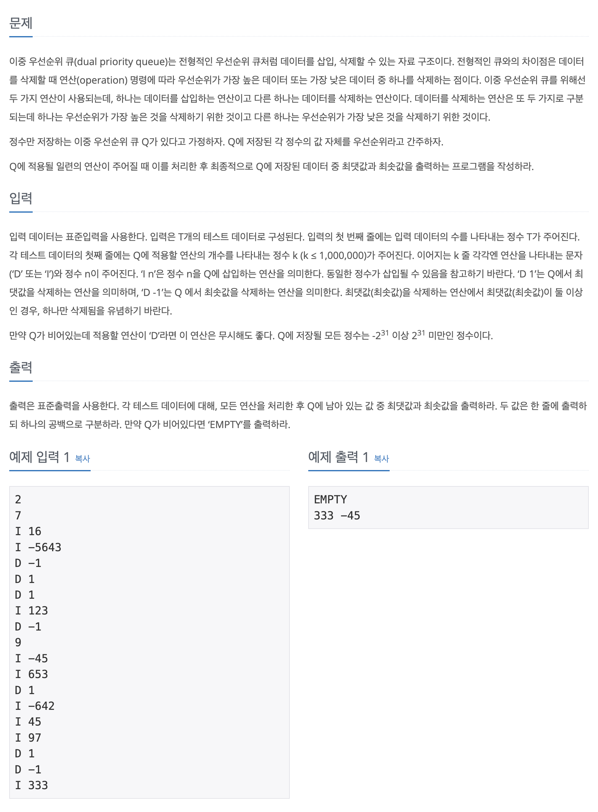

## 📖 [이중 우선순위 큐](https://www.acmicpc.net/problem/7662)

---
#### 📍 풀이
- 우선순위 큐를 직접 구현하여 해결하는 문제
- 우선순위 큐를 두개 구현하여 풀었을 때 해결할 수 없는 이유
  - 오름차순과 내림차순의 우선순위 큐 두개를 구현하여 데이터를 삽입/삭제할 경우 두 큐에서 모두 삽입/삭제가 이루어져야 한다.
  - 최솟값을 오름차순 큐에서 삭제할 경우에는 (반대도 마찬가지) `pq.remove(Object O)` 메소드를 사용해야 하는데 이에 대한 시간복잡도가 `O(n)`이기 때문에 시간초과가 발생한다.
- 따라서 TreeMap으로 우선순위 큐를 구현하여 해결했다.
  - key에는 값을, value에는 key가 삽입된 개수를 저장하여 원소의 삽입/삭제를 수행했다.
---
#### 📍 느낀점
- 애초에 Java에 내장된 우선순위 큐를 사용하면 해결할 수 없는 문제였지만, 해결 과정에서 문제의 조건을 꼼꼼히 파악하지 못해서 디버깅에 더욱 시간이 오래걸렸다. 제발 문제를 정확히 읽고 최대한 한번에 조건을 파악하도록 노력하자.
- TreeMap의 새로운 메소드인 `firstKey()`와 `lastKey()` 를 알게 되었다. 잊어버리지 말자.