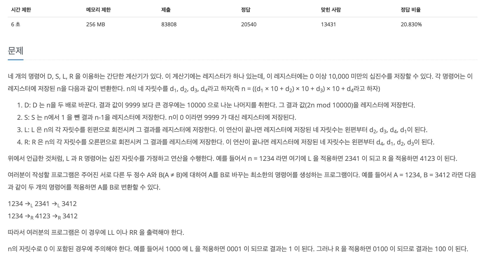
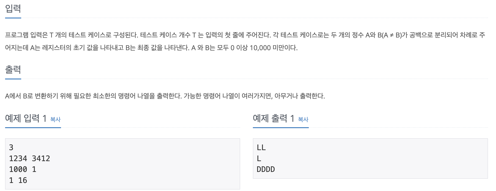

## 📖 [DSLR](https://www.acmicpc.net/problem/9019)
#### 📍 문제

---
#### 📍 풀이
- BFS를 활용하여 연산 결과의 숫자를 방문한 적이 없다면 연산을 실행하여 Queue에 삽입하였다. 
- 입력받은 숫자를 배열로 바꾸어 객체에 저장하도록 했다.
---
#### 📍 느낀점
- 언뜻 보면 수학 문제처럼 보여서 처음에는 visited를 확인하는 것을 깜빡했다. BFS를 이용할 때에는 무조건 방문 체크를 하는 것을 잊지 말자!
- 실행해야 하는 연산의 모양이 전부 다른데다가, 숫자 - 배열을 넘나드는 연산이라 다양한 방법으로 시도를 해보았는데 일단 배열로 만든 후에 조작하는 것이 더 쉬운 것 같다. 