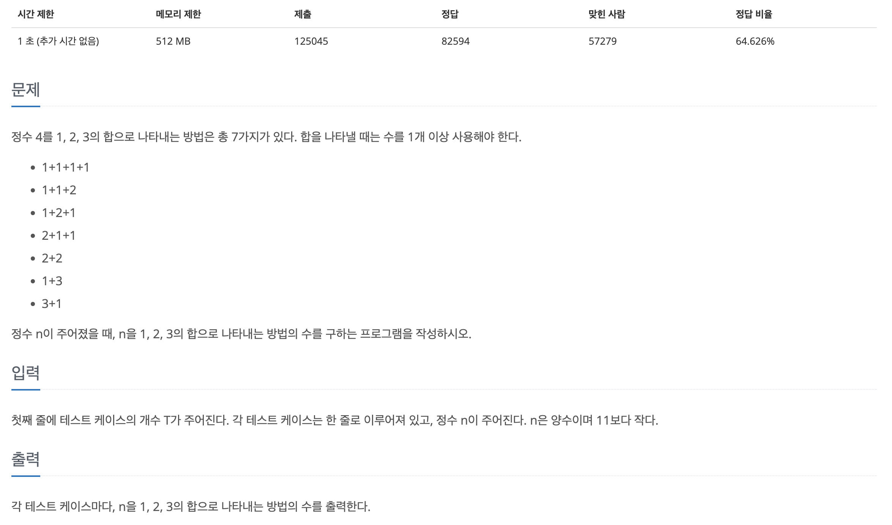
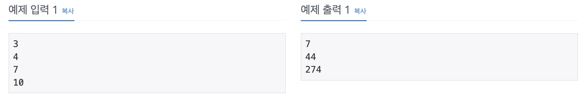

## 📖 [1, 2, 3 더하기](https://www.acmicpc.net/problem/9095)
#### 📍 문제

---
#### 📍 풀이
- 점화식 dp[i] = dp[i-1] + dp[i-2] + dp[i-3] 을 세워 DP를 이용한 풀이
- 숫자 i는 i-3에서 3을 더한 것, i-2에서 2를 더한 것, i-1에서 1을 더한 것과 같기 때문에 i-3, i-2, i-1번째 숫자의 방법의 개수를 모두 더한 것이 i를 더할 수 있는 방법의 개수가 된다.
---
#### 📍 느낀점
- 점화식 세우는 것이 너무 어렵다.. 