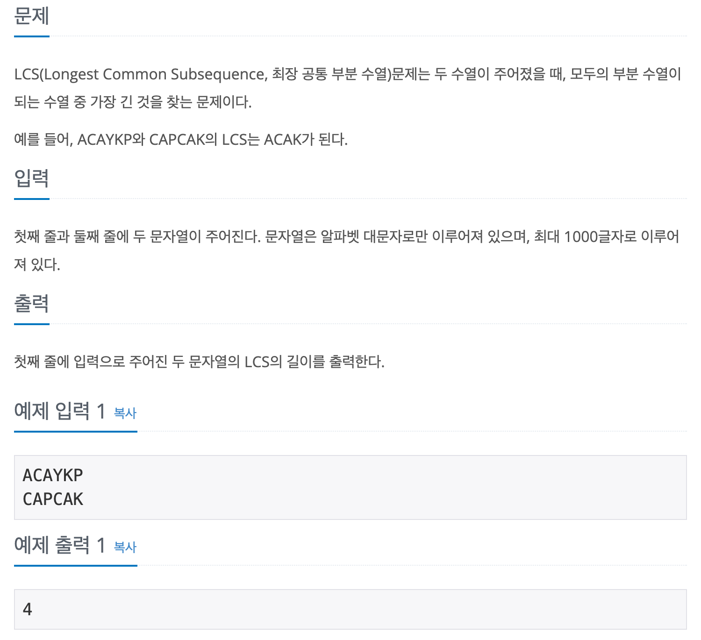

## 📖 [LCS](https://www.acmicpc.net/problem/9251)

---
#### 📍 풀이
- dp를 이용한 풀이
- 첫 번째 문자열을 순회하며 각 문자에 대해 두 번째 문자열과 비교하며 dp를 수행한다.
- 첫 번째 문자열에서 `j`번째 문자를 `character`라고 했을 때, 두 번째 문자열을 순회하며 `character`와 일치하는 문자가 있는지 찾는다.
  - 이 때 동시에, 이 전 인덱스 까지의 dp 값 중 최댓값 `tmp_max`를 찾는다.
- 두 번째 문자열에 `character`와 일치하는 문자가 있고, 그 문자의 인덱스를 `i` 라고 할 때, `dp[i]` 값과 `tmp_max + 1` 값을 비교하여 더 큰 값을 `tmp`에 임시로 저장한다.
- `i`번째 까지의 `tmp_max`를 비교 갱신한 후, `dp[i]`에 `tmp`값을 삽입한다.
- 전체 최댓값인 `max`를 비교 갱신한다.
---
- 실수 1
  - 처음에는 그냥 두 번째 배열 순회와 동시에 `tmp_max`를 비교 갱신했더니, 순회 한 번에 일치하는 문자를 발견하는 대로 `tmp_max`가 1씩 늘어났다.
  - 예를 들어, `str1 = A`, `str2 = ABACDA`인 경우 dp 배열은 `[1 0 2 0 0 3]`이 되었다.
- 실수 2
  - 실수 1을 해결하기 위해, `str2`에서 `character`와 일치하는 문자가 있으면 `dp[i] = Math.max(tmp_max + 1, dp[i])`를 수행하고, 그렇지 않은 경우에만 `tmp_max = Math.max(tmp_max, dp[i])`로 비교 갱신했다. 그러나 해당 풀이는 같은 문자가 연속되는 경우를 고려하지 못했다.
  - 예를 들어, `str1 = AA`, `str2 = ABACDA`인 경우 dp 배열은 `[1 0 1 0 0 1]`이 되었다.
- 이러한 실수들을 해결하기 위해, 문자가 일치하는 경우에 최댓값을 비교 하면서 바로 `dp[i]`에 삽입하지 않고, 임시로 저장한 후에 `tmp_max`를 갱신하고 `dp[i]`에 삽입했다.
---
#### 📍 느낀점
- 몇개월 전, 처음 이 문제를 접했을 때는 다른 풀이를 참고해도 도저히 이해가 가지 않았는데, 지금은 스스로 구현할 수 있게 되어서 뿌듯했다.
- 그러나 dp 문제는 항상 반례를 찾는게 어렵다. 이번에도 실제 코딩테스트였다면 수많은 반례에서 틀렸을 것이다. 문제를 설계하는 능력만큼 문제에서 간과하기 쉬운 반례를 빨리 찾는 연습이 중요하다.