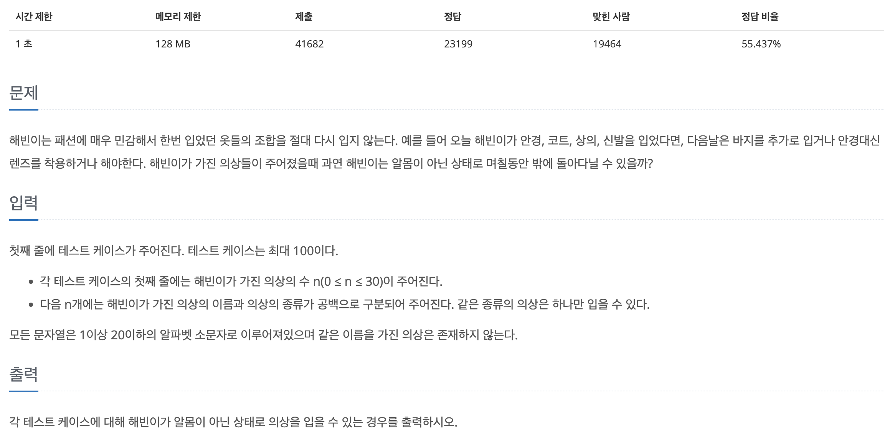
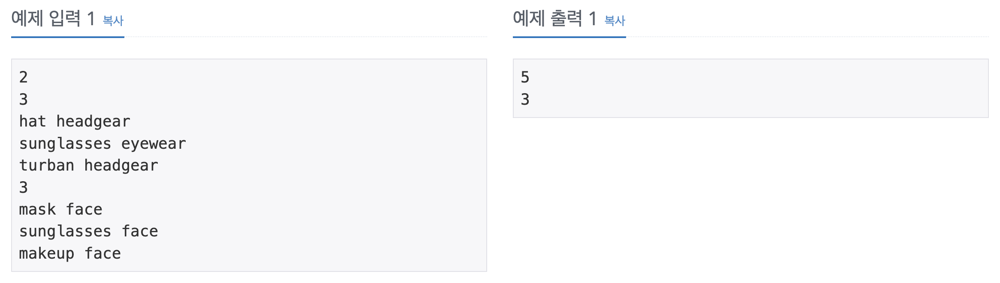

## 📖 [패션왕 신해빈](https://www.acmicpc.net/problem/9375)
#### 📍 문제

---
#### 📍 풀이
- Map을 이용하여 중복을 빠르게 탐색
- 한 종류의 옷에 대해서는 (옷의 개수 + 1) 가지 경우의 수가 존재한다. 각각의 옷을 입는 경우와 아예 입지 않는 경우가 있기 때문이다.
- 따라서 Map을 순회하여 각 옷의 종류의 경우의 수를 모두 곱한다.
- 마지막으로, 모든 옷을 아예 입지 않는 경우는 없어야 하므로 1을 뺀다.
---
#### 📍 느낀점
- 처음에 무작정 조합 method를 만들어 가능한 모든 조합의 수에 대해 method를 실행하였는데, 이렇게 풀이하니 1%에서 바로 시간초과가 발생했다.
- 최대한 스스로 해결하고 싶어서 어떤 공식이 있을지 오래 고민했는데 찾지 못했다. 결국 다른 사람의 풀이를 보고 힌트를 얻었다.
- 시간 복잡도 계산이 아직 어렵다. 특히 재귀함수에서 많이 헤매는 것 같은데 관련 이론을 더욱 공부해야겠다. 그리고 이 문제와 같이 조합이지만 조합의 개수가 정해진 것이 아닌, 모든 가능한 조합을 묻는 문제가 꽤 있는데, 이번 문제의 풀이를 떠올리면 훨씬 수월해질 것 같다.