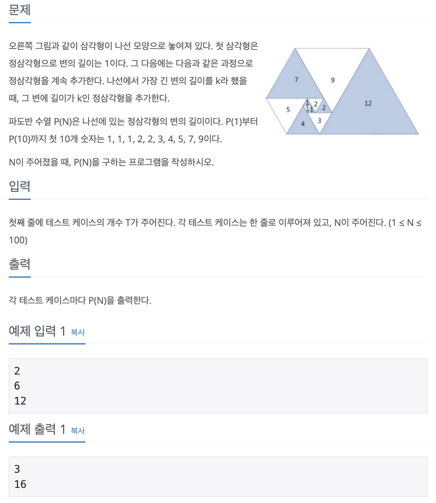

## 📖 [파도반 수열](https://www.acmicpc.net/problem/9461)

---
#### 📍 풀이
- 점화식을 이용한 dp 풀이
  - `dp[n+3] = dp[n] + dp[n+1]`
---
#### 📍 느낀점
- 규칙을 찾다보니 해당 점화식을 세우게 되었는데 정확히 어떤 원리로 이러한 규칙이 도출된 것인지는 잘 모르겠다. 그래도 dp문제에서 눈에 보이는 규칙을 찾기 힘들 때 점화식으로 접근하는 방법은 꽤 익힌 것 같다고 느꼈다.
- 수열 문제에서 제발 자료형에 주의하자. 이번에도 처음에 int로 선언했는데, n의 범위를  확인하고 최댓값을 고민하는 습관이 필요하다.