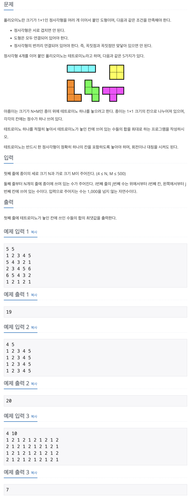

## 📖 [테트로미노](https://www.acmicpc.net/problem/14500)


---
#### 📍 풀이
- 완전탐색 및 재귀를 이용한 풀이
- 모든 r,c 를 탐색하며 해당 칸을 포함하여 총 4칸으로 만들 수 있는 경우의 수를 모두 비교한다.
- 첫 번째 실수
  - r,c 를 탐색할 때마다 visited 배열을 초기화하여 시간 초과
- 두 번째 실수
  - 'ㅜ' 모양은 재귀로 구현할 수 없는데, 해당 모양을 구하는 알고리즘 누락
- 세 번째 실수
  ```
  for (int r = 0; r < N; r++) {
			for (int c = 0; c < M; c++) {
				visited[r][c] = true;
				sol(r, c, 1, arr[r][c]);
				solT(r,c);
			}
		}
    ```
  - `visited[r][c]`를 다시 false로 초기화해주지 않음.
  - r,c 차례에서 해당 칸을 포함하는 모든 경우의 수를 탐색한다고 생각했는데, 아니었다. 반드시 r,c 칸에서 시작하는 모양만 탐색 가능하므로 다시 방문 체크를 취소해야 한다.
- 네 번째 실수
  ```
  public static void solT(int r, int c) {
      int sum = arr[r][c];

      for (int d = 0; d < 4; d++) {
        int nr = r + dr[d];
        int nc = c + dc[d];

        if (nr >= 0 && nr < N && nc >= 0 && nc < M) {
          sum += arr[nr][nc];
        }
      }

      for (int d = 0; d < 4; d++) {
        int nr = r + dr[d];
        int nc = c + dc[d];

        if (nr >= 0 && nr < N && nc >= 0 && nc < M) {
          ans = Math.max(ans, sum - arr[nr][nc]);
        }
      }
    }
    ```
  - 'ㅜ' 모양 탐색의 잘못된 구현
  - 먼저 사방탐색을 진행하며 숫자를 더하고, 다시 사방탐색을 진행하며 한 칸씩 빼는 방식으로 구현하였다.
  - 이렇게 하면 경계조건에서 제대로 탐색이 이루어지지 않는다. 예를들어 가장 첫번째 행에 있는 'ㅜ' 모양의 경우 첫번째 사방탐색에서 더한 숫자들의 모양이 'ㅜ' 모양이지만, 두번째 사방탐색에서 위쪽 부분이 경계를 벗어나기 때문에 해당 칸을 뺄 수 없다. 따라서 최댓값으로 비교할 수 없다.
  - 따라서 'ㅜ', 'ㅗ', 'ㅓ', 'ㅏ' 모양을 전부 구현하여 탐색하도록 한다.

---
#### 📍 느낀점
- 문제를 처음 읽으면 단순한 방법으로 쉽게 풀 수 있을 것 같았는데, 따져야 할 조건이 많아서 계속 반례를 찾아가며 수정해야 했다. 초기 코드 설계 및 문제 이해에 대한 중요성을 느꼈다.