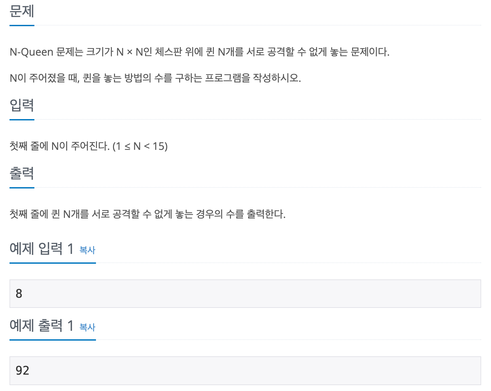

## 📖 [N-Queen](https://www.acmicpc.net/problem/9663)

---
#### 📍 풀이
- 재귀 및 백트랙킹
- row를 1씩 증가시키며 탐색할 것이기 때문에 위쪽 새로 방향과 대각선 방향에 대해서 고려할 필요가 없다.
  - 따라서 r번째 행에서 c번째 열의 방문이 가능한지 아닌지를 판단하는 isImpossible 2차원 배열을 생성하고, 재귀 함수가 실행될 때 마다 isImpossible[r]을 false로 초기화
  - 또한 i번째 행에서 말의 위치를 index와 value로 저장하는 position 배열 이용
- 재귀함수
  - r번째 행에서
    - r보다 작은 position의 index(i)를 모두 탐색하며
    - i번째 행에 위치하는 말을 기준으로
    - 같은 열, 왼쪽 아래 또는 오른쪽 아래 대각선 방향에 위치하면
    - isImpossible[r][c] = false
  - isImpossible 체크 후 모든 c에 대해 방문이 가능하면
    - position[r] 에 c 저장 후, 
    - r+1로 재귀 호출
  - r이 N이면 모든 행에서 가능한 경우를 찾았기 때문에 return
- 실수
  - isImpossible을 1차원 배열로 만들어 재귀함수가 호출될 때 마다 선언 및 초기화를 했더니 메모리 초과가 발생했다.
  - 따라서 isImpossible을 main에서 선언하고, 함수 내에서 초기화했는데 정답과 일치하지 않았다.
  - 애초에 isImpossible을 1차원 배열로 만들면 안되는 문제이다.
    - c를 순회하며 방문체크를 할 때 r행에 대한 isImpossible에서 이루어져야 한다. 
    - 그러나 1차원 배열로 확인하게 되면 return 되었을 때의 isImpossible은 r+1 번째 행에서 검사했던 배열이 된다.
---
#### 📍 느낀점
- 처음에 오답이 출력되었을 때 디버깅이 너무너무 어려웠다. 재귀 문제를 풀 때 가장 어려운 부분이 어떤 변수를 전역으로 사용하고, 어떤 변수를 어디서 초기화해야 하는지에 대한 문제인 것 같다. 비슷한 문제를 여러 개 풀면서 연습이 필요하다.