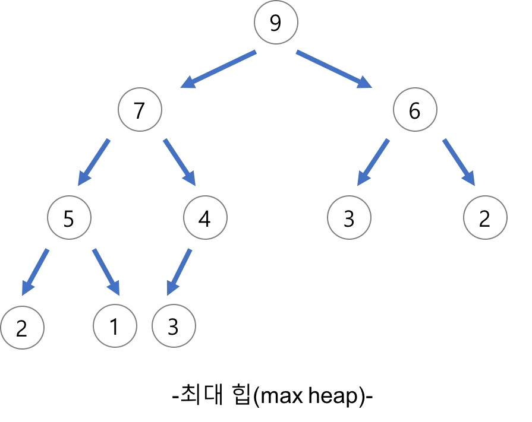
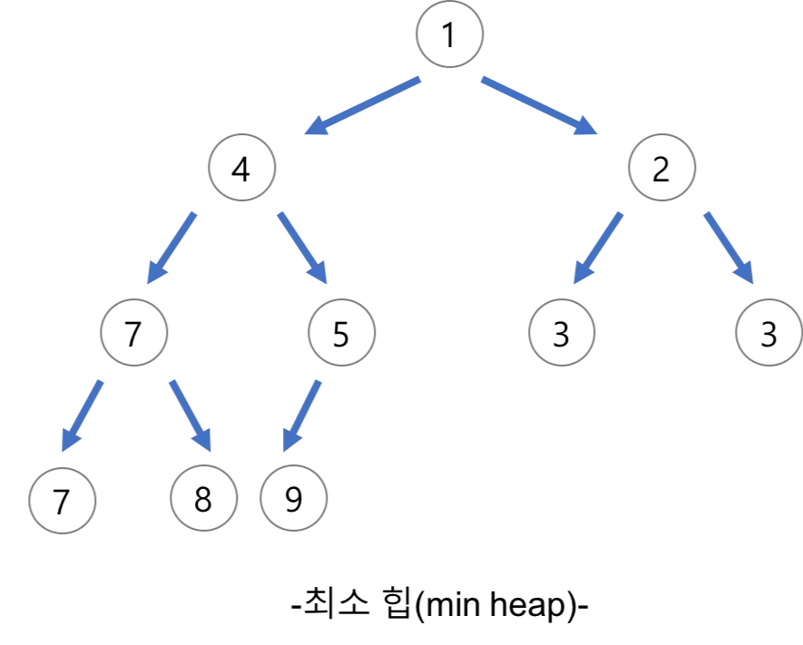

# Heap

## ( 1 ) 힙 (Heap)

 💡 **완전 이진 트리** 에 있는 노드 중에서 키 값이 가장 큰 노드나 키 값이 가장 작은 노드를 찾기 위해서 만든 자료구조


### 1 ) 최대 힙 (Max Heap)

💡 키 값이 가장 큰 노드를 찾기 위한 완전 이진 트리
- 부모 노드의 키값 ≥ 자식 노드의 키 값
- 루트 노드 : 키 값이 가장 큰 노드

EX)


### 2 ) 최소 힙 (Min Heap)

💡 키 값이 가장 작은 노드를 찾기 위한 완전 이진 트리
- 부모 노드의 키 값 ≤ 자식 노드의 키 값
- 루트 노드 : 키 값이 가장 작은 노드

EX)




## ( 2 ) 힙의 삽입과 삭제

### 1 ) 삽입

1. 가장 마지막 노드에 값을 삽입한다.
2. 부모 노드와 비교하면서 부모보다 키 값이 크면(최소 힙일 경우에는 작으면) 자리를 바꾼다.
3. 부모와 값이 같거나 부모보다 값이 작을 때(최소 힙일 경우에는 클 때), 또는 더이상 비교할 부모 노드가 없을 때 자리를 확정한다.

```java
public class MaxHeap {
	static int[] heap = new int[100];
	static int heapSize;

	public static void main(String[] args) {
		heapPush(1);
		heapPush(38);
		heapPush(7);
		heapPush(5);
		heapPush(90);
		heapPush(62);
		
		System.out.println(heapPop());
		System.out.println(heapPop());
		System.out.println(heapPop());
		System.out.println(heapPop());
		System.out.println(heapPop());
		System.out.println(heapPop());
		
		/* 결과
		   90
		   62
		   38
		   7
		   5
		   1 
		*/
	}

	// 삽입
	static void heapPush(int data) {
		// 마지막 노드에 삽입
		heap[++heapSize] = data;

		int ch = heapSize;
		int p = ch / 2;

		while (p > 0 && heap[p] < heap[ch]) {
			// 자식이 더 크면 swap
			int tmp = heap[p];
			heap[p] = heap[ch];
			heap[ch] = tmp;

			ch = p;
			p = ch / 2;
		}
	}

	// 삭제
	static int heapPop() {
		// 루트에 있는 값 삭제
		int popItem = heap[1];

		// 마지막에 있는 원소 루트로 옮기기
		heap[1] = heap[heapSize--];

		int p = 1;
		int ch = p * 2;

		while (ch <= heapSize && heap[p] < heap[ch]) {
			// 오른쪽 자식이 존재하고, 오른쪽 자식의 값이 왼쪽 자식의 값보다 클 경우 오른쪽 자식으로 이동
			if (ch + 1 <= heapSize && heap[ch] < heap[ch + 1]) {
				ch++;
			}

			// 자식이 더 크면 swap
			int tmp = heap[p];
			heap[p] = heap[ch];
			heap[ch] = tmp;

			p = ch;
			ch = p * 2;
		}

		return popItem;
	}
}

```

### 2 ) 삭제

- 힙에서는 루트 노드의 원소만을 삭제할 수 있으며, 삭제한 값을 반환한다.
- 힙의 종류에 따라 최댓값 또는 최솟값을 구할 수 있다.
1. 루트 노드의 원소를 삭제하고 반환한다.
2. 마지막 노드를 삭제하고 해당 키 값을 루트 노드에 삽입한다.
3. 자식 노드 중 더 큰 값(최소 힙일 경우에는 더 작은 값)과 비교하여 자식 노드보다 값이 작으면(최소 힙일 경우에는 값이 크면)  자리를 바꾼다.
4. 자식과 값이 같거나 자식보다 값이 클 때(최소 힙일 경우에는 작을 때), 또는 더이상 비교할 자식 노드가 없을 때 자리를 확정한다.

```java
public class MinHeap {
	static int[] heap = new int[100];
	static int heapSize;

	public static void main(String[] args) {
		heapPush(1);
		heapPush(38);
		heapPush(7);
		heapPush(5);
		heapPush(90);
		heapPush(62);

		System.out.println(heapPop());
		System.out.println(heapPop());
		System.out.println(heapPop());
		System.out.println(heapPop());
		System.out.println(heapPop());
		System.out.println(heapPop());

		/* 결과
		   1
		   5
		   7
		   38
		   62
		   90
		 */
	}
	
	// swap
	static void swap(int a, int b) {
		int tmp = heap[a];
		heap[a] = heap[b];
		heap[b] = tmp;
	}
	
	// 삽입 
	static void heapPush(int data) {
		// 마지막 노드에 삽입
		heap[++heapSize] = data;

		int ch = heapSize;
		int p = ch / 2;
		
		// 자식이 더 작으면 swap
		while (p > 0 && heap[p] > heap[ch]) {
			swap(p, ch);

			ch = p;
			p = ch / 2;
		}
	}
	
	// 삭제 
	static int heapPop() {
		// 루트에 있는 값 삭제
		int popItem = heap[1];
		
		// 마지막에 있는 원소 루트로 옮기기
		heap[1] = heap[heapSize--];

		int p = 1;
		int ch = p * 2;

		while (ch <= heapSize && heap[p] > heap[ch]) {
			// 오른쪽 자식이 존재하고, 오른쪽 자식의 값이 왼쪽 자식의 값보다 작을 경우 오른쪽 자식으로 이동
			if (ch + 1 <= heapSize && heap[ch + 1] < heap[ch]) {
				ch = ch + 1;
			}
			// 자식이 더 작으면 swap
			swap(p, ch);

			p = ch;
			ch = p * 2;
		}

		return popItem;
	}
}

```

---

## ( 3 ) 힙의 활용

### 1 ) 우선순위 큐

> 우선순위 큐를 구현하는 가장 효율적인 방법이 힙을 사용하는 것이다.
> 
- 노드 하나의 추가 / 삭제의 시간 복잡도 : $O(logN)$
- 최댓값 / 최솟값 구할 때의 시간 복잡도 : $O(1)$
- 완전 정렬보다 관리 비용이 적다.

### 2 ) 힙 정렬

> 힙 정렬은 힙 자료구조를 이용해서 이진 트리와 유사한 방법으로 수행된다.
> 
- 배열에 저장된 자료를 정렬하기에 유용하다.
1. 힙 정렬 과정
    1. 주어진 값들을 힙에 하나씩 삽입한다.
    2. 힙에서 순차적으로 값을 하나씩 제거한다.
2. 힙 정렬의 시간 복잡도
    - $O(NlogN)$
        
        → N개의 노드 삽입 연산 $O(logN)$ + N개의 노드 삭제 연산 $O(logN)$