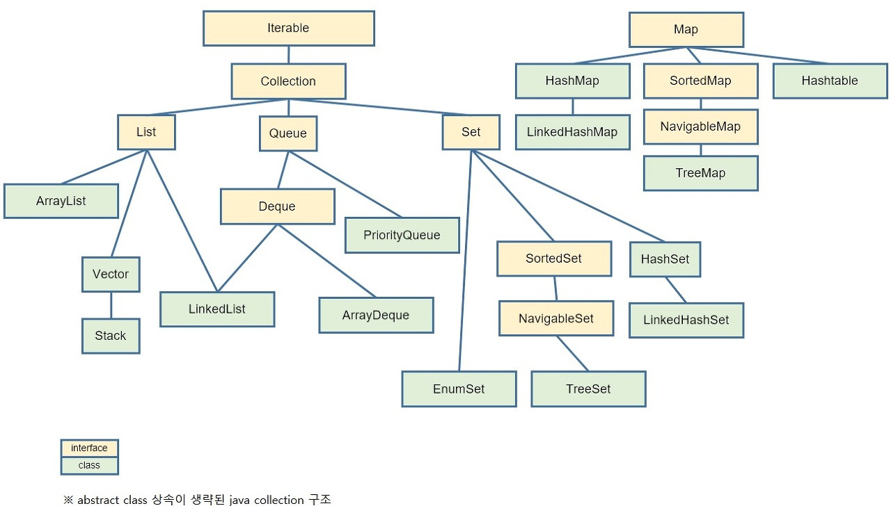

# ⚙️ 자료구조 정리

- [List](https://github.com/sehaim/algorithm/tree/master/Data_Structure/LIST)
- [Map](https://github.com/sehaim/algorithm/tree/master/Data_Structure/MAP)
- [Set](https://github.com/sehaim/algorithm/tree/master/Data_Structure/SET)
- [Queue](https://github.com/sehaim/algorithm/tree/master/Data_Structure/QUEUE)
- [Stack](https://github.com/sehaim/algorithm/tree/master/Data_Structure/STACK)