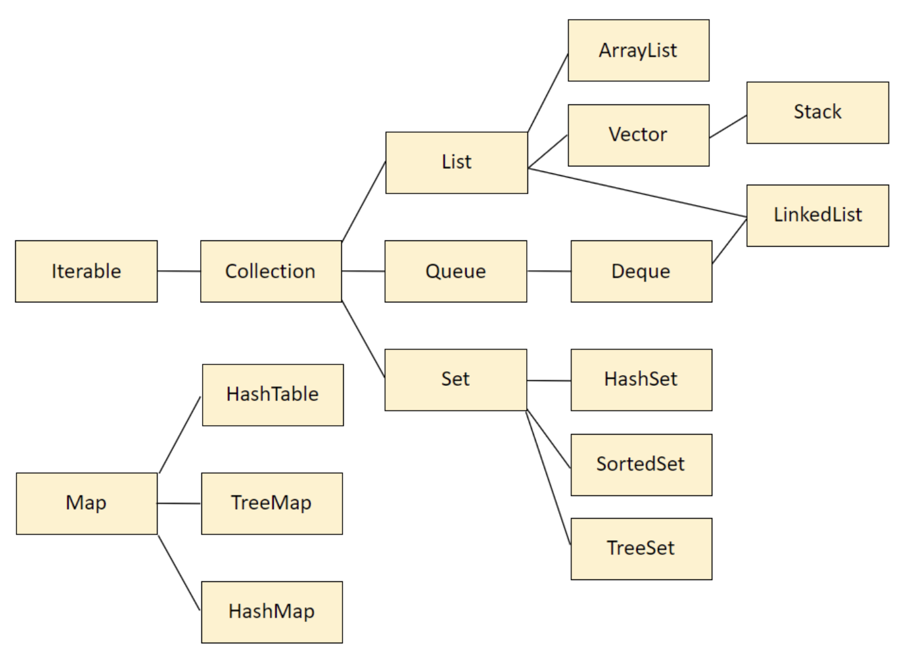

# ⚙️ 자료구조 정리

### Collections

- [List](https://github.com/sehaim/algorithm/tree/master/Data_Structure/LIST)
- [Stack](https://github.com/sehaim/algorithm/tree/master/Data_Structure/STACK)
- [Queue](https://github.com/sehaim/algorithm/tree/master/Data_Structure/QUEUE)
- [Set](https://github.com/sehaim/algorithm/tree/master/Data_Structure/SET)
- [Map](https://github.com/sehaim/algorithm/tree/master/Data_Structure/MAP)

### Custom
- [Tree](https://github.com/sehaim/algorithm/tree/master/Data_Structure/TREE)
- [Heap](https://github.com/sehaim/algorithm/tree/master/Data_Structure/HEAP)