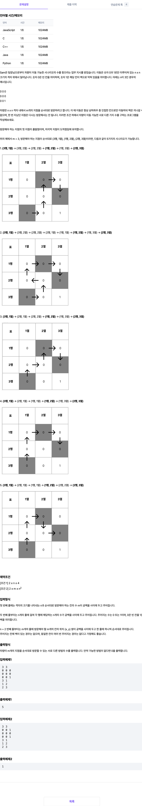

## 📖 [순서대로 방문하기](https://softeer.ai/practice/6246)
#### 📍 문제

---
#### 📍 풀이
- DFS를 이용한 풀이
- 도착 지점을 차례로 저장하고, 해당 도착 지점에 도달하면 그 다음 도착 지점을 향해 다시 재귀를 호출한다.
- 최종 목적지에 도착하면 정답에 1을 더한다.
  - 최종 목적지 도달 여부는 arrive_count 를 통해 판단한다.
- 최단 거리가 아닌 경우의 수를 묻는 문제이기 때문에 해당 지점에 방문 후 방문 check를 다시 false로 한다.
  - 시작 지점도 반드시 방문 check를 해야 한다.
---
#### 📍 느낀점
- 그래프 탐색 문제를 풀 때 항상 방문 check에서 실수를 하는 것 같다. 주의하자.