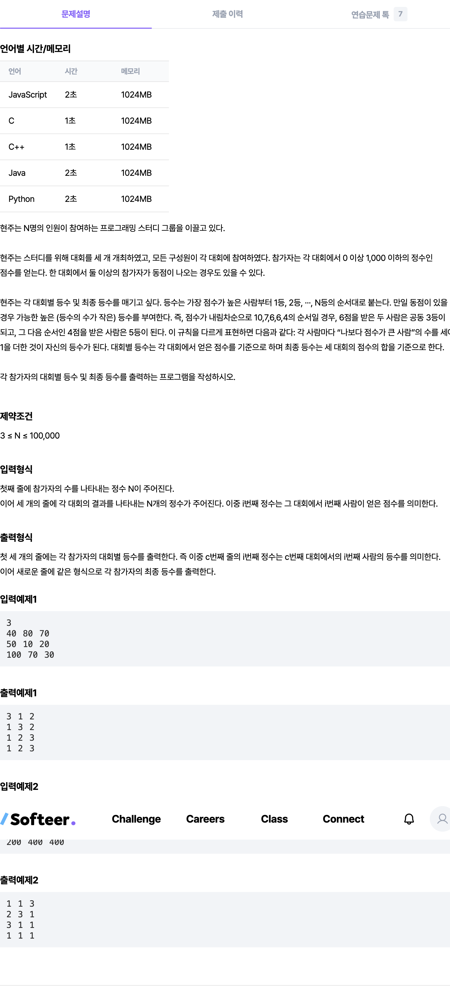

## 📖 [성적 평가](https://softeer.ai/practice/6250)
#### 📍 문제

---
#### 📍 풀이
- 이분 탐색을 이용한 풀이
- `N * 4` 이차원 배열 `score` 에 점수와 점수의 총 합을 입력한다.
- `score`의 행을 탐색하며 행마다 점수 배열을 `sortedScore`에 새롭게 복사하여 복사한 배열을 오름차순으로 정렬한다.
- `score`의 각 열에 해당하는 점수를 `sortedScore`에서 이분탐색으로 찾는다.
  - 찾으면 바로 종료하는 것이 아니라, 해당 점수와 일치하는 가장 높은 인덱스를 찾도록 한다.
  - 인덱스를 찾으면 등수는 `N - index` 이다.
---
#### 📍 느낀점
- 처음에 입력하면서 정렬이 가능한 TreeMap이나 TreeSet을 활용하는 문제인가 했지만 결국 몇 등인지 찾으려면 이분탐색이 가장 좋은 풀이라고 생각했다.
- 이분탐색을 하지 않고 등수를 정하는 방법으로는, 인덱스를 점수와 함께 저장하고, 점수 기준으로 인덱스를 내림차순으로 정렬하는 방법이 가능할 것 같다.
- 항상 얕은 복사, 깊은 복사를 헷갈려서 실수를 많이 하는데, 배열 복사할 때 꼭 주의하자!!