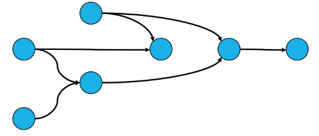

# 위상 정렬 (Topological Sorting)

## ( 1 ) 위상 정렬이란?

1.  **위상 정렬**
    - **순서가 있는 작업**을 차례로 진행해야 할 때 순서를 결정하기 위해 사용하는 알고리즘
    - **사이클 없는 방향 그래프**의 모든 노드를 주어진 방향성에 어긋나지 않게 순서를 나열하는 것
    - EX ) 대학 선수과목, 요리 순서 등
    
2. **위상 정렬 특징**
    - 모든 정점을 방문하기 전에 Queue가 공백 상태가 되면 사이클이 존재하는 것이다.
        
        (사이클이 존재하면 진입 차수가 0이 될 수 없음)
        
    - 그래프의 유형은 DAG 이다.
        
        
        
        DAG (Directed Acyclic Graph, 유향 비사이클 그래프)
        
    - 여러 해답이 존재할 수 있다.
        
        (진입 차수가 0인 값이 동시에 생성된다면 작성한 코드에 따라 답이 달라진다.)
        
    - 시간 복잡도 : $O(V+E)$
    

## ( 2 ) Queue 구현

1. **진입 차수**가 0인 모든 노드를 Queue에 삽입 → 진출 차수 필요 X
2. Queue가 공백상태가 될 때까지 반복 수행
    1. Queue에서 원소를 꺼내 해당 노드에서 나가는 간선을 그래프에서 제거한다.
        
        (연결된 노드의 진입 차수를 감소시킨다.)
        
    2. **새롭게 진입 차수가 0이 된 노드를 Queue에 삽입한다.**

<aside>
📌 Queue에서 꺼내지는 순서 (Queue에 들어온 순서)가 정렬을 수행한 결과이다.

</aside>

```java
public static String[] cook = { "", "재료구매", "양념장만들기", "고기재우기", "고기손질", "제육볶음만들기", "식사", "뒷정리", "채소손질", "밥하기" };

public static String input = "9 9\r\n" + "1 4\r\n" + "1 8\r\n" + "2 3\r\n" + "4 3\r\n" + "8 5\r\n" + "3 5\r\n"
			+ "5 6\r\n" + "9 6\r\n" + "6 7\r\n" + "";

public static void main(String[] args) {
		Scanner sc = new Scanner(input);

		int V = sc.nextInt(); // 정점의 수
		int E = sc.nextInt(); // 간선의 수 // 방향 있음

		int[][] adj = new int[V + 1][V + 1]; // 정점의 번호가 1번부터 시작이기 때문에 배열의 크기는 V+1
		int[] degree = new int[V + 1]; // 진입차수 저장

		for (int i = 0; i < E; i++) {
			int A = sc.nextInt();
			int B = sc.nextInt();

			adj[A][B] = 1; // 가중치가 따로 없기 때문에 1로 표기, 유향이기 때문에 반대는 처리하지 않는다.

			// 진입차수 증가
			degree[B]++;
		}

		Queue<Integer> queue = new LinkedList<>();

		// 1. 진입차수가 0인 정점들을 넣는다.
		for (int i = 1; i < V + 1; i++) {
			if (degree[i] == 0)
				queue.offer(i);
		}

		StringBuilder sb = new StringBuilder();

		// 2. Queu가 공백상태가 될 때까지 반복한다.
		while (!queue.isEmpty()) {
			// queue에서 정점을 한 개씩 꺼낸다.
			int curr = queue.poll();
			sb.append(cook[curr] + "\n");
			// 연결되어 있는 간선을 제거 (실제로 제거하는 것은 아님)
			for (int i = 0; i < V + 1; i++) {
				if (adj[curr][i] == 1) {
					degree[i]--; // 진입차수를 1씩 줄인다.
					adj[curr][i] = 0; // 간선 제거

					// 진입차수가 새롭게 0이 되었다면 queue에 넣는다.
					if (degree[i] == 0)
						queue.offer(i);
				}
			}
		}

		System.out.println(sb);

		sc.close();
}
```

## ( 3 ) Stack 구현

1. **진입 차수**가 0인 모든 노드에서 DFS 탐색 수행
2. DFS 수행
    1. 해당 노드를 방문 표시
    2. 인접하면서 방문하지 않은 노드가 있다면  DFS 재귀 호출
    3. 함수 return 하기 전 Stack에 현재 노드 저장
3. Stack이 공백 상태가 될 때 까지 pop

<aside>
📌 Stack에서 꺼내지는 순서를 뒤집으면 위상 정렬을 수행한 결과이다.

</aside>

```java
public static String[] cook = { "", "재료구매", "양념장만들기", "고기재우기", "고기손질", "제육볶음만들기", "식사", "뒷정리", "채소손질", "밥하기" };

public static int V, E;
public static int[][] adj;
public static int[] degree;
public static boolean[] visited; // 방문 체크
public static Stack<Integer> stack;

public static String input = "9 9\r\n" + "1 4\r\n" + "1 8\r\n" + "2 3\r\n" + "4 3\r\n" + "8 5\r\n" + "3 5\r\n"
			+ "5 6\r\n" + "9 6\r\n" + "6 7\r\n" + "";

public static void main(String[] args) {
		Scanner sc = new Scanner(input);

		V = sc.nextInt(); // 정점의 수
		E = sc.nextInt(); // 간선의 수 // 방향 있음

		adj = new int[V + 1][V + 1]; // 정점의 번호가 1번부터 시작이기 때문에 배열의 크기는 V+1
		degree = new int[V + 1]; // 진입차수 저장
		visited = new boolean[V + 1];
		stack = new Stack<>();

		for (int i = 0; i < E; i++) {
			int A = sc.nextInt();
			int B = sc.nextInt();

			adj[A][B] = 1; // 가중치가 따로 없기 때문에 1로 표기, 유향이기 때문에 반대는 처리하지 않는다.

			// 진입차수 증가
			degree[B]++;
		}

		for (int i = 1; i < V + 1; i++) {
			// 진입차수가 0인 정점들을 모두 DFS 탐색
			if (degree[i] == 0)
				DFS(i);
		}
		while (!stack.isEmpty()) {
			System.out.println(cook[stack.pop()]);
		}
		sc.close();
	}

public static void DFS(int v) {
		visited[v] = true;

		for (int i = 1; i < V + 1; i++) {
			// 인접하고, 방문하지 않은 노드가 있다면 방문
			if (adj[v][i] == 1 && !visited[i]) {
				DFS(i);
			}
		}

		// 갈 수 있는 노드를 전부 탐색했으면 실행
		stack.add(v);
}
```